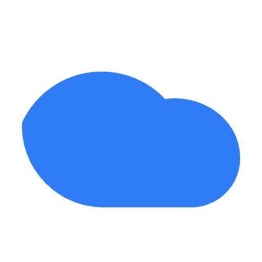
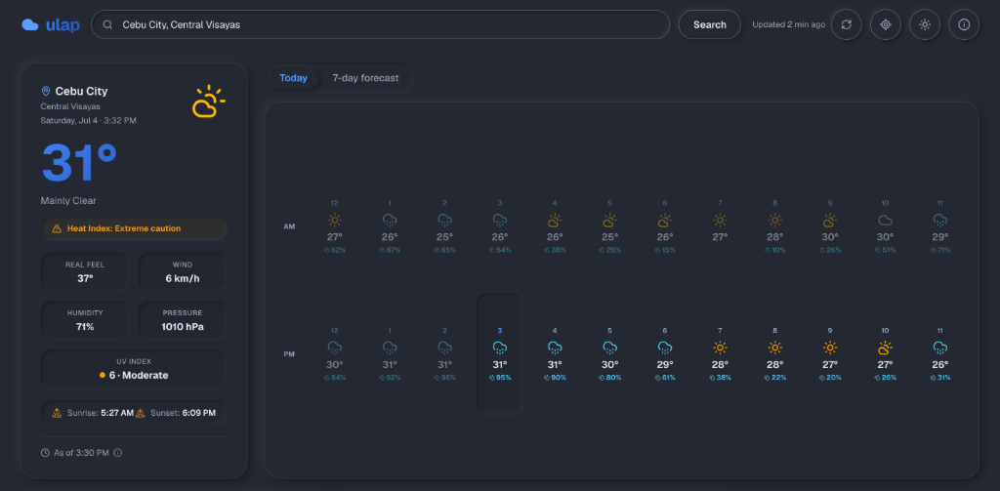
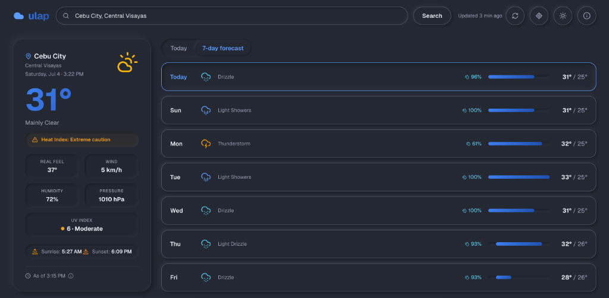
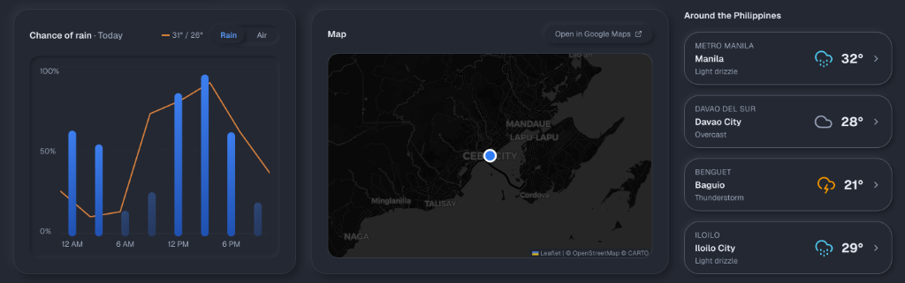

<div align="center">



# ulap

**ulap** (Filipino for *"cloud"*) is a modern, open-source weather dashboard for the Philippines.

<p>
  
  
  
  
  
  
</p>

A beautifully aggregated multi-source weather pipeline served through a premium **soft-UI (neumorphic)** interface.

<br />

<figure>
  
  <figcaption style="margin-top: 8px; margin-bottom: 24px; color: #6b7280; font-size: 0.9em; font-style: italic;">
    <strong>Hourly Forecast View</strong>: Tactile, clock-aligned forecast carousel separating AM/PM conditions for today.
  </figcaption>
</figure>

<figure>
  
  <figcaption style="margin-top: 8px; margin-bottom: 24px; color: #6b7280; font-size: 0.9em; font-style: italic;">
    <strong>7-Day Weekly Forecast</strong>: Crisp, high-contrast outlook tracking daily condition profiles and temperature bounds.
  </figcaption>
</figure>

<figure>
  
  <figcaption style="margin-top: 8px; color: #6b7280; font-size: 0.9em; font-style: italic;">
    <strong>Analytics & Mapping</strong>: Interactive precipitation probability charts, theme-synchronized Leaflet mapping, and regional summaries.
  </figcaption>
</figure>

</div>

---

**ulap** (Filipino for *"cloud"*) is an open-source weather dashboard for the Philippines — live conditions, a multi-day forecast, hourly rain probability, and air quality for any Philippine city.

It's an **API-integration project**: several free weather and mapping APIs stitched together behind the app's own server routes, and presented through a **neumorphic (soft-UI)** interface. Built with **Next.js (App Router) · React · TypeScript · Tailwind CSS v4**, and released under the [MIT License](LICENSE).

> 💡 The running app has an in-app **About** page (the ⓘ button in the header, or [`/about`](app/about/page.tsx)) that credits the developer and walks through how the API integration and the neumorphic design system work.

## Features

- **Live current conditions** — temperature, real feel, wind, pressure, humidity, sunrise/sunset, all shown in the searched city's local time, plus an *"As of"* timestamp of the underlying reading. The current conditions and the forecast come from the **same model (Open-Meteo)**, so the headline number and the strip below it never contradict each other.
- **Hourly today + multi-day forecast** — a Google Weather-style toggle backed by real per-hour data from Open-Meteo: *Today* shows all 24 hours of the local day in two clock-aligned rows (12 AM–11 AM over 12 PM–11 PM), with the current hour highlighted; the *multi-day* view shows a full week of day cards with real high/low temperatures. Both strips scroll horizontally with neumorphic arrow buttons (and swipe/trackpad) — no visible scrollbar, nothing cut off at any screen size.
- **Hourly rain chart** — real probability-of-precipitation data. In the multi-day view, click any day card to see that day's hourly rain chances.
- **Air quality** — toggle the chart panel to see the Air Quality Index (1–5) and PM2.5 / PM10 / O₃ / NO₂ concentrations.
- **Search down to barangay level** — the autocomplete is backed by Photon (OpenStreetMap data), so specific places like *Holy Spirit, Quezon City* or *Poblacion, Makati* resolve with their city and province shown; weather loads by exact coordinates and the place keeps its own name on display. Philippines-only, keyboard-navigable, with OpenWeatherMap geocoding as an automatic fallback. Or use the locate button (reverse-geocoded) for where you are.
- **"Around the Philippines"** — a strip of other major cities (Cebu, Davao, Baguio, Iloilo, Manila) you can tap to switch to, sourced from Open-Meteo and always excluding the city you're currently viewing.
- **Themed interactive map** — Leaflet with CARTO basemaps (light and dark to match the theme), centered on the selected city.
- **Dark / light theme** — follows your OS preference by default; the toggle persists your choice, with no flash on reload.
- **Remembers your city** — the last searched city is stored locally and restored on your next visit.
- **Installable PWA with offline fallback** — a web manifest and a conservative service worker make ulap installable to the home screen; the last successful payload is kept locally, so going offline shows clearly-labeled saved weather instead of an error.
- **PH-aware warnings** — UV index with WHO categories, a DOH/PAGASA-style heat-index caution, and a banner when thunderstorms or heavy rain are expected in the next 24 hours.
- **Resilient UX** — loading skeletons, inline error banners that keep existing data on screen, quiet handling of failed background refreshes, and a friendly setup screen if the API key is missing.
- **Accessible** — semantic HTML, keyboard-focus styles, ARIA labels on interactive elements and chart bars, and `prefers-reduced-motion` support.
- **Responsive** — single-column on mobile, multi-column dashboard on desktop.

## Getting started

### 1. Prerequisites

- Node.js (LTS)
- A free OpenWeatherMap API key — sign up at [openweathermap.org/api](https://openweathermap.org/api). (Open-Meteo needs no key.)

### 2. Install and configure

```bash
npm install
cp .env.example .env.local
# then edit .env.local and paste your API key
```

`.env.local` should contain:

```
OPENWEATHER_API_KEY=your_key_here
```

> **Security & freshness:** the key never reaches the browser — all upstream calls go through the app's own `/api/weather` and `/api/geocode` route handlers. Weather is fetched **live** (`cache: "no-store"`), so being online always means real-time data; place-name geocoding is cached server-side for 24 hours since it rarely changes. Offline, the client shows the last saved payload from `localStorage`. The legacy `NEXT_PUBLIC_OPENWEATHER_API_KEY` name still works as a fallback.

### 3. Run

```bash
npm run dev
```

Open [http://localhost:3000](http://localhost:3000).

### Scripts

| Command | What it does |
| --- | --- |
| `npm run dev` | Start the development server |
| `npm run build` | Production build |
| `npm run start` | Serve the production build |
| `npm run lint` | Run ESLint |

## Project structure

```
app/
├── api/
│   ├── weather/route.ts    # Aggregates current + forecast + air + cities into one payload
│   └── geocode/route.ts    # PH-only place search + reverse geocoding (Photon → OWM fallback)
├── about/
│   ├── page.tsx            # In-app About / credits / how-the-API-works page
│   └── layout.tsx          # About-page metadata
├── components/
│   ├── TopBar.tsx          # Branding, search form, geolocation, theme toggle, About link
│   ├── TodayCard.tsx       # Current conditions + "As of" freshness indicator
│   ├── HourlyStrip.tsx     # Today's 24 hours, clock-aligned, current hour marked
│   ├── WeekList.tsx        # Selectable multi-day forecast cards (high/low)
│   ├── Carousel.tsx        # Horizontal scroll strip with neumorphic arrow controls
│   ├── ChartPanel.tsx      # Toggles between the rain chart and air-quality panels
│   ├── RainChart.tsx       # Hourly rain-probability bar chart
│   ├── AirQualityCard.tsx  # AQI badge + pollutant bars
│   ├── WeatherIcon.tsx     # Condition code → colored lucide icon
│   ├── MapSection.tsx      # Map card (loads LeafletMap client-side)
│   ├── LeafletMap.tsx      # Leaflet + CARTO basemap, theme-aware
│   ├── CitiesList.tsx      # "Around the Philippines" city switcher
│   └── ServiceWorker.tsx   # Registers the PWA service worker
├── hooks/
│   └── useTheme.ts         # Dark/light theme state, persisted to localStorage
├── types/
│   └── weather.ts          # Typed OpenWeatherMap + Open-Meteo response shapes
├── utils/
│   └── weather.ts          # Formatting, unit conversion, WMO mapping, daily aggregation
├── globals.css             # Design tokens (light + dark) mapped into Tailwind
├── layout.tsx              # Metadata, fonts, no-flash theme init script
└── page.tsx                # Data fetching + dashboard layout
```

## How it works

1. **Data** — the client calls the app's own `/api/weather` route, which uses **OpenWeatherMap** to resolve the place (name, coordinates, timezone, sunrise/sunset), then in parallel fetches **Open-Meteo** for the current conditions *and* the forecast (hourly temperature / rain-probability / condition, 8 daily summaries, UV), OpenWeatherMap air pollution, and the nearby-cities strip (also Open-Meteo, in one multi-coordinate call). Everything is fetched live and returned as one payload. The dashboard silently revalidates every 10 minutes and on tab refocus, shows an "Updated X min ago" badge with a manual refresh, and an "As of" timestamp for the reading itself. If Open-Meteo is unreachable, the route falls back to OpenWeatherMap's own forecast.
2. **One consistent model** — the current-conditions card and every forecast panel are driven by Open-Meteo, so the big temperature and the hourly strip / rain chart / daily view always agree. OpenWeatherMap is used only for the place metadata, air quality, and geocoding fallback.
3. **Condition mapping** — Open-Meteo reports WMO weather codes; `wmoToIconCode()` maps them onto the OpenWeatherMap-style ids that `WeatherIcon` renders, so both sources share one icon system.
4. **Theming** — all colors are CSS custom properties defined in `globals.css` for light and dark, mapped into Tailwind v4 via `@theme inline` so components use semantic utilities like `bg-surface` and `text-muted`. A tiny inline script in `layout.tsx` applies the saved theme before first paint.
5. **Times** — upstream returns UTC timestamps plus a timezone offset; all displayed times are shifted into the *city's* local time, not the viewer's.

## Design decisions

- **Neumorphic (soft-UI) design system** — surfaces share the page background and get their depth from paired light/dark shadows. Raised (`neu`, `neu-sm`) and inset (`neu-inset`, `neu-inset-sm`) utilities are defined once in `globals.css`; selection states are "pressed in" rather than outlined. Because neumorphism drops borders, keyboard focus rings and text contrast are deliberately strong.
- **Fluid, screen-filling layout** — a 12-column grid up to 1800px wide reflows from a single column on phones to hero + forecast + chart / map + cities regions on desktop, so large screens are actually used.
- **Live-first, cache-as-fallback** — online means real-time data (`no-store`); the last payload in `localStorage` is only shown when the network is unavailable, with a clearly-labeled offline banner.
- **Semantic color tokens over hard-coded hex** — every component reads from the token palette, so dark mode is a single class flip on `<html>`.
- **Errors don't wipe the screen** — a failed search shows a dismissible banner while the previous city's data stays visible; a full-page error appears only when there is nothing to show yet.
- **Motion is minimal** — micro-transitions (≤150 ms) on hover/focus only, and everything is suppressed under `prefers-reduced-motion`.

## Git workflow

This repo uses a lightweight git-flow:

- `main` — stable; only receives release PRs from `develop`, merged manually on GitHub.
- `develop` — integration branch.
- `feature/<name>` — one branch per feature with atomic conventional commits, merged into `develop` via PR with a merge commit (so the graph shows merge lines).

Helper script (requires the [GitHub CLI](https://cli.github.com/)):

```bash
scripts/gitflow.sh setup            # one-time: enable the commit-msg hook
scripts/gitflow.sh feature my-thing # start feature/my-thing off develop
# ...make atomic commits...
scripts/gitflow.sh ship             # push, PR to develop, merge
scripts/gitflow.sh release          # open the develop → main PR
```

The `commit-msg` hook enforces `type(scope): subject` conventional messages and blocks AI co-author trailers. `ship` refuses features with fewer than 3 commits (pass `--force` for a genuinely complete small change) — let work accumulate instead of merging one-commit branches.

## Credits

Built by **Anthony Celeres** — [@anthony-celeres](https://github.com/anthony-celeres).

Data & libraries:

- Current conditions, hourly + daily forecast, and UV: [Open-Meteo](https://open-meteo.com/) (CC BY 4.0, no API key)
- Place resolution, air quality, and geocoding fallback: [OpenWeatherMap](https://openweathermap.org/)
- Autocomplete + reverse geocoding: [Photon](https://photon.komoot.io/) (OpenStreetMap data, ODbL)
- Icons: [Lucide](https://lucide.dev/) (`lucide-react`)
- Map: [Leaflet](https://leafletjs.com/) with © [OpenStreetMap](https://www.openstreetmap.org/copyright) © [CARTO](https://carto.com/attributions) basemaps
- Fonts: [Geist](https://vercel.com/font) via `next/font`

## License

Released under the [MIT License](LICENSE) — © 2026 Anthony Celeres. You're free to use, modify, and build on it with attribution.
